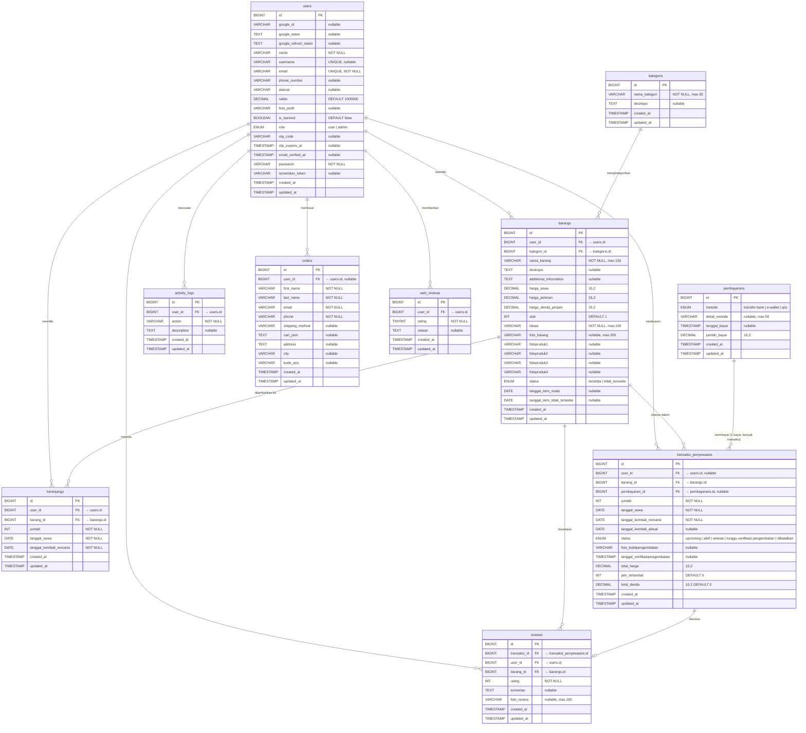

### Relasi Antar Tabel (Diperbaiki)

| Relasi | Kardinalitas | Keterangan |
|--------|:-----------:|-----------|
| users → barangs | 1 : N | Satu user (owner) memiliki banyak barang |
| users → keranjangs | 1 : N | Satu user memiliki banyak item keranjang |
| users → transaksi_penyewaans | 1 : N | Satu user melakukan banyak transaksi sewa |
| users → reviews | 1 : N | Satu user menulis banyak review |
| users → activity_logs | 1 : N | Satu user memiliki banyak catatan aktivitas |
| users → orders | 1 : N | Satu user dapat membuat banyak order |
| users → web_reviews | 1 : N | Satu user memberikan banyak ulasan web |
| kategoris → barangs | 1 : N | Satu kategori memiliki banyak barang |
| barangs → keranjangs | 1 : N | Satu barang bisa di banyak keranjang |
| barangs → transaksi_penyewaans | 1 : N | Satu barang bisa disewa banyak kali |
| barangs → reviews | 1 : N | Satu barang mendapat banyak review |
| **pembayarans → transaksi_penyewaans** | **1 : N** | **1 pembayaran mencakup banyak transaksi** — ketika checkout multi-barang dari keranjang, semua dibayar 1x tapi masing-masing barang punya baris transaksi sendiri |
| transaksi_penyewaans → reviews | 1 : 1 | Satu transaksi hanya punya satu review |

---
