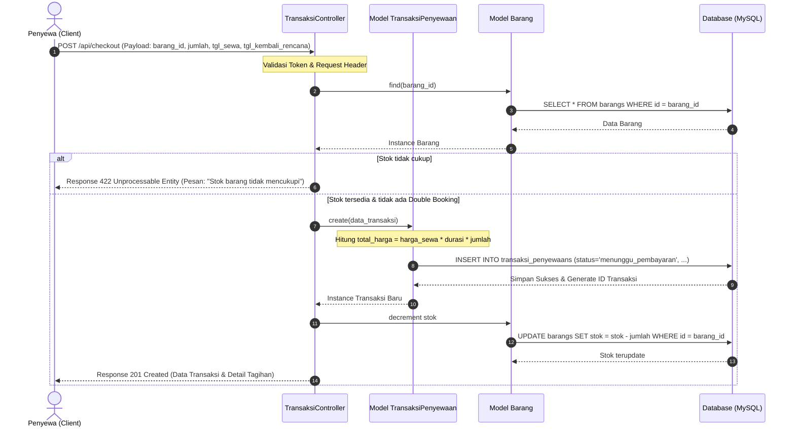

# Laporan Pengembangan Sistem - Sewain
**Platform Penyewaan Barang Berbasis Web dengan Sistem Manajemen Transaksi Terintegrasi**

---

## DAFTAR ISI
1. [Bagian 1: Backlog, Task Breakdown & Timeline](#bagian-1-backlog-task-breakdown--timeline)
   - 1.1 [Backlog & User Stories (≥10 Stories + Acceptance Criteria)](#11-backlog--user-stories-10-stories--acceptance-criteria)
   - 1.2 [Task Breakdown](#12-task-breakdown)
   - 1.3 [Timeline 2 Sprint](#13-timeline-2-sprint)
2. [Bagian 2: Risk Register (≥5 Risiko Proyek)](#bagian-2-risk-register-5-risiko-proyek)
3. [Bagian 3: Desain Modul & Arsitektur MVC](#bagian-3-desain-modul--arsitektur-mvc)
   - 3.1 [Desain Modul Arsitektur MVC Laravel](#31-desain-modul-arsitektur-mvc-laravel)
   - 3.2 [Diagram Alur Fitur Utama (User → Controller → Model → DB)](#32-diagram-alur-fitur-utama-user--controller--model--db)
   - 3.3 [API Contract (Minimal 3 API)](#33-api-contract-minimal-3-api)
4. [Bagian 4: Analisis Keputusan & Refleksi Teknis](#bagian-4-analisis-keputusan--refleksi-teknis)
   - 4.1 [Analisis Trade-off (3 Keputusan Desain + Alternatif)](#41-analisis-trade-off-3-keputusan-desain--alternatif)
   - 4.2 [Refleksi 3 Prinsip Hooker](#42-refleksi-3-prinsip-hooker)
   - 4.3 [Antisipasi 2 Risiko Implementasi Teknis](#43-antisipasi-2-risiko-implementasi-teknis)
5. [Bagian 5: README.md Final](#bagian-5-readmemd-final)
   - 5.1 [Link README.md di GitHub](#51-link-readmemd-di-github)
   - 5.2 [Penjelasan Perubahan README](#52-penjelasan-perubahan-readme)
6. [Bagian 6: Release Tag v1.0.0](#bagian-6-release-tag-v100)
   - 6.1 [Proses Pembuatan Tag](#61-proses-pembuatan-tag)
   - 6.2 [Fitur yang Dicakup dalam v1.0.0](#62-fitur-yang-dicakup-dalam-v100)
   - 6.3 [Screenshot Proses & GitHub Releases](#63-screenshot-proses--github-releases)

---

## Bagian 1: Backlog, Task Breakdown & Timeline

### 1.1 Backlog & User Stories (12 Stories + Acceptance Criteria)

Berikut adalah daftar 12 User Story terpilih yang mencakup kebutuhan fungsional sistem beserta *Acceptance Criteria* (AC) menggunakan format *Given-When-Then*:

#### US-01: Registrasi Akun (Penyewa/Owner)
* **User Story:** As a user (penyewa/owner), I want mendaftarkan akun baru dengan memasukkan nama lengkap, email, nomor telepon, alamat, dan kata sandi, so that saya dapat masuk dan menggunakan platform Sewain.
* **Acceptance Criteria:**
  * **Skenario 1: Registrasi Berhasil dengan Data Valid**
    * **Given** pengguna berada di halaman registrasi dan memasukkan nama, email unik yang belum terdaftar, nomor telepon, alamat, dan kata sandi berkekuatan cukup.
    * **When** pengguna menekan tombol "Register".
    * **Then** sistem menyimpan akun baru ke basis data dengan status belum terverifikasi, mengirimkan kode OTP ke email, dan mengalihkan pengguna ke halaman verifikasi OTP.
  * **Skenario 2: Registrasi Gagal karena Email Sudah Terdaftar**
    * **Given** pengguna memasukkan data registrasi lengkap namun menggunakan email yang sudah terdaftar di sistem.
    * **When** pengguna menekan tombol "Register".
    * **Then** sistem menolak pendaftaran dan menampilkan pesan kesalahan: "Email sudah digunakan".

#### US-02: Verifikasi OTP setelah Registrasi
* **User Story:** As a user, I want memverifikasi akun menggunakan kode OTP yang dikirim ke email saya, so that akun saya aktif dan dapat digunakan untuk masuk ke platform.
* **Acceptance Criteria:**
  * **Skenario 1: OTP Valid**
    * **Given** pengguna berada di halaman verifikasi OTP dan memiliki kode OTP aktif yang dikirim ke emailnya.
    * **When** pengguna memasukkan kode OTP yang benar dan menekan tombol "Verifikasi".
    * **Then** sistem memperbarui status akun menjadi terverifikasi, menandai OTP sebagai terpakai, dan mengalihkan pengguna ke halaman masuk (login).
  * **Skenario 2: OTP Kadaluarsa/Salah**
    * **Given** pengguna memasukkan kode OTP yang salah atau sudah kadaluarsa (lebih dari 15 menit).
    * **When** pengguna menekan tombol "Verifikasi".
    * **Then** sistem menampilkan pesan kesalahan "Kode OTP tidak valid atau telah kadaluarsa" dan meminta pengguna memasukkan kembali atau meminta OTP baru.

#### US-03: Login Autentikasi
* **User Story:** As a registered user, I want masuk ke akun menggunakan email dan kata sandi saya, so that saya dapat mengakses fitur transaksi penyewaan.
* **Acceptance Criteria:**
  * **Skenario 1: Kredensial Benar**
    * **Given** pengguna memasukkan email terdaftar dan kata sandi yang cocok.
    * **When** pengguna menekan tombol "Login".
    * **Then** sistem membuat sesi login aktif (atau token Sanctum jika via API) dan mengalihkan pengguna ke halaman dashboard utama.
  * **Skenario 2: Akun Dibekukan**
    * **Given** pengguna memiliki status akun dibekukan (`is_banned = true`) oleh admin.
    * **When** pengguna menekan tombol "Login" dengan kredensial yang benar.
    * **Then** sistem menolak akses login dan menampilkan pesan: "Akun Anda telah dibekukan oleh admin karena pelanggaran kebijakan".

#### US-04: Lupa Password & Reset via OTP
* **User Story:** As a user who forgot my password, I want menyetel ulang kata sandi saya dengan menggunakan verifikasi OTP email, so that saya dapat memulihkan akses ke akun saya.
* **Acceptance Criteria:**
  * **Skenario 1: Pengiriman OTP Reset Sukses**
    * **Given** pengguna berada di halaman "Lupa Password" dan memasukkan email terdaftar.
    * **When** pengguna menekan tombol "Kirim OTP".
    * **Then** sistem membuat kode OTP baru, mengirimkannya ke email, dan mengalihkan pengguna ke form penyetelan ulang sandi.
  * **Skenario 2: Reset Sandi Baru Berhasil**
    * **Given** pengguna memasukkan OTP yang valid dan kata sandi baru yang memenuhi kriteria keamanan.
    * **When** pengguna menekan tombol "Reset Password".
    * **Then** kata sandi lama diubah dengan enkripsi bcrypt baru, OTP ditandai sebagai kedaluwarsa, dan pengguna diarahkan ke login.

#### US-05: Pencarian & Filter Katalog Barang
* **User Story:** As a renter, I want mencari barang berdasarkan kata kunci, kategori, dan memfilternya berdasarkan harga sewa serta lokasi umum, so that saya dapat menemukan barang sewa yang tepat dengan cepat.
* **Acceptance Criteria:**
  * **Skenario 1: Pencarian Menghasilkan Data**
    * **Given** terdapat barang di katalog yang sesuai dengan pencarian.
    * **When** pengguna mengetikkan kata kunci "Kamera" dan memilih filter kota "Solo".
    * **Then** sistem menampilkan daftar barang kategori kamera yang tersedia di kota Solo lengkap dengan harga sewa per harinya.
  * **Skenario 2: Tidak Ada Hasil Cocok**
    * **Given** tidak ada barang yang cocok dengan filter yang ditentukan.
    * **When** pengguna menerapkan filter harga di atas batas maksimal barang yang ada.
    * **Then** sistem menampilkan pesan "Barang yang Anda cari tidak ditemukan".

#### US-06: Mengelola Katalog Barang (Owner)
* **User Story:** As an owner, I want menambah, memperbarui, dan menghapus barang sewaan di katalog pribadi saya, so that barang tersebut dapat ditawarkan kepada calon penyewa.
* **Acceptance Criteria:**
  * **Skenario 1: Menambah Barang Baru**
    * **Given** pemilik mengisi formulir tambah barang (nama, deskripsi, harga sewa, jaminan, denda keterlambatan per jam, stok, lokasi, dan mengunggah foto).
    * **When** menekan tombol "Simpan".
    * **Then** barang tersimpan di basis data dengan relasi ID pemilik, dan muncul di daftar katalog dengan status "tersedia".
  * **Skenario 2: Menghapus Barang yang Sedang Disewa**
    * **Given** barang yang ingin dihapus sedang dalam transaksi sewa aktif (status sewa belum selesai).
    * **When** pemilik menekan tombol "Hapus".
    * **Then** sistem menolak penghapusan barang dan menampilkan pesan: "Barang tidak dapat dihapus karena sedang dalam masa penyewaan aktif".

#### US-07: Menambahkan Barang ke Keranjang Sewa
* **User Story:** As a renter, I want menambahkan satu atau beberapa barang sewaan ke keranjang belanja sewa saya sebelum melakukan checkout, so that saya dapat memproses beberapa barang sekaligus.
* **Acceptance Criteria:**
  * **Skenario 1: Menambahkan ke Keranjang Sukses**
    * **Given** penyewa memilih barang dengan jumlah stok tersedia lebih dari atau sama dengan jumlah yang diminta.
    * **When** menekan tombol "Tambah ke Keranjang".
    * **Then** barang masuk ke keranjang belanja sewa pengguna, dan total item keranjang diperbarui.
  * **Skenario 2: Melebihi Stok Tersedia**
    * **Given** barang hanya memiliki sisa stok 1 unit.
    * **When** penyewa mencoba menambahkan 2 unit barang tersebut ke keranjang.
    * **Then** sistem membatasi input dan memunculkan pesan kesalahan: "Jumlah barang melebihi stok yang tersedia".

#### US-08: Checkout & Pembuatan Transaksi
* **User Story:** As a renter, I want melakukan checkout terhadap item di keranjang dengan menentukan rentang tanggal sewa, so that sistem dapat menghitung estimasi biaya dan mencatat transaksi penyewaan baru.
* **Acceptance Criteria:**
  * **Skenario 1: Checkout Berhasil**
    * **Given** keranjang penyewa berisi item dan tanggal mulai sewa serta tanggal selesai sewa telah ditentukan dengan benar (tanggal mulai tidak boleh di masa lalu).
    * **When** menekan tombol "Checkout".
    * **Then** sistem menghitung `total_harga` (harga sewa × jumlah barang × durasi hari), membuat baris transaksi di tabel `transaksi_penyewaans` dengan status "menunggu pembayaran", dan mengosongkan keranjang belanja.

#### US-09: Simulasi Pembayaran
* **User Story:** As a renter, I want membayar biaya sewa menggunakan simulasi saldo platform atau metode simulasi transfer, so that transaksi sewa saya aktif dan barang siap digunakan.
* **Acceptance Criteria:**
  * **Skenario 1: Pembayaran Berhasil dengan Saldo Cukup**
    * **Given** transaksi berstatus "menunggu pembayaran" dan pengguna memiliki saldo simulasi yang cukup untuk membayar total harga transaksi.
    * **When** pengguna memilih metode simulasi "Saldo" dan mengonfirmasi pembayaran.
    * **Then** sistem memotong saldo pengguna sebesar nominal tagihan, menambahkan nominal tersebut ke saldo pemilik barang (setelah potong biaya admin jika ada), mencatat data di tabel pembayaran, dan mengubah status transaksi menjadi "aktif".
  * **Skenario 2: Pembayaran Gagal karena Saldo Kurang**
    * **Given** saldo simulasi pengguna kurang dari total tagihan transaksi.
    * **When** pengguna mengonfirmasi pembayaran.
    * **Then** sistem membatalkan proses pembayaran, memunculkan notifikasi "Saldo simulasi tidak mencukupi", dan status transaksi tetap "menunggu pembayaran".

#### US-10: Pengembalian Barang & Denda Otomatis
* **User Story:** As a renter, I want mengembalikan barang sewaan setelah masa sewa selesai, so that transaksi saya selesai dan denda keterlambatan dihitung otomatis jika mengembalikan terlambat.
* **Acceptance Criteria:**
  * **Skenario 1: Pengembalian Tepat Waktu**
    * **Given** transaksi berstatus "aktif" dan tanggal aktual pengembalian sama dengan atau kurang dari tanggal rencana kembali.
    * **When** penyewa mengajukan pengembalian dengan menyertakan foto bukti pengembalian.
    * **Then** sistem mencatat `tanggal_kembali_aktual`, menghitung denda = 0, mengubah status transaksi menjadi "menunggu verifikasi pengembalian", dan mengirim permintaan persetujuan ke pemilik barang.
  * **Skenario 2: Pengembalian Terlambat (Perhitungan Denda)**
    * **Given** tanggal aktual pengembalian melewati batas tanggal rencana kembali.
    * **When** penyewa mengajukan pengembalian.
    * **Then** sistem menghitung selisih waktu terlambat (dalam jam), mengalikan dengan `harga_denda_perjam` barang, mencatat `total_denda` di transaksi, dan mewajibkan penyewa melunasi denda sebelum status transaksi diselesaikan.

#### US-11: Verifikasi Pengembalian oleh Owner
* **User Story:** As an owner, I want memverifikasi pengembalian barang yang dikirim oleh penyewa, so that saya dapat mengonfirmasi bahwa barang telah diterima kembali dalam kondisi baik dan transaksi ditutup secara resmi.
* **Acceptance Criteria:**
  * **Skenario 1: Verifikasi Sukses**
    * **Given** transaksi berstatus "menunggu verifikasi pengembalian" dan pemilik telah memeriksa barang secara fisik.
    * **When** pemilik menekan tombol "Verifikasi Pengembalian Selesai".
    * **Then** status transaksi diubah menjadi "selesai", stok barang dikembalikan ke katalog (+jumlah disewa), dan dana jaminan sewa (jika ada) dikembalikan ke penyewa.

#### US-12: Monitoring & Moderasi Akun oleh Admin
* **User Story:** As an admin, I want memantau data platform (jumlah user, total transaksi, katalog barang) dan membekukan akun yang bermasalah, so that keamanan dan integritas platform terjaga.
* **Acceptance Criteria:**
  * **Skenario 1: Pembekuan Akun Bermasalah**
    * **Given** admin melihat laporan transaksi bermasalah atau akun dengan rating buruk dari halaman manajemen admin.
    * **When** admin menekan tombol "Freeze Account" pada profil pengguna tersebut.
    * **Then** kolom `is_banned` pada tabel user diubah menjadi `true`, sesi aktif pengguna tersebut langsung dihapus, dan pengguna tidak dapat login kembali.

---

### 1.2 Task Breakdown

Setiap User Story di atas dipecah ke dalam tugas-tugas teknis spesifik untuk mempermudah pengerjaan:

| ID Story | Target Komponen | Tugas Teknis Pengembangan |
|----------|-----------------|---------------------------|
| **US-01** | Database & Auth | 1. Membuat migration `users_table` dengan atribut profil tambahan ([0001_01_01_000000_create_users_table.php](file:///d:/Nia/Kuliah/SEM4/RPL/praktikum-rpl-a-10/src/database/migrations/0001_01_01_000000_create_users_table.php)).<br>2. Membuat model [User.php](file:///d:/Nia/Kuliah/SEM4/RPL/praktikum-rpl-a-10/src/app/Models/User.php) dengan proteksi fillable dan hashing password.<br>3. Membuat register API controller method di [ApiAuthController.php](file:///d:/Nia/Kuliah/SEM4/RPL/praktikum-rpl-a-10/src/app/Http/Controllers/Api/ApiAuthController.php).<br>4. Membuat UI form registrasi blade di [register.blade.php](file:///d:/Nia/Kuliah/SEM4/RPL/praktikum-rpl-a-10/src/resources/views/auth/register.blade.php). |
| **US-02** | OTP & Mailer | 1. Membuat migration `otps_table` untuk merekam kode verifikasi.<br>2. Menulis logika pengiriman kode OTP via email mock / SMTP lokal.<br>3. Membuat endpoint `/verify-otp` di [api.php](file:///d:/Nia/Kuliah/SEM4/RPL/praktikum-rpl-a-10/src/routes/api.php) dan route web.<br>4. Menulis unit test verifikasi OTP di [Feature/AuthTest.php](file:///d:/Nia/Kuliah/SEM4/RPL/praktikum-rpl-a-10/src/tests/Feature/AuthTest.php). |
| **US-03** | Auth & Session | 1. Membuat method `login` di [ApiAuthController.php](file:///d:/Nia/Kuliah/SEM4/RPL/praktikum-rpl-a-10/src/app/Http/Controllers/Api/ApiAuthController.php) dengan pembatasan token Sanctum.<br>2. Membuat middleware `CheckBanned` untuk menolak user dengan `is_banned = true`.<br>3. Membuat UI blade login di [login.blade.php](file:///d:/Nia/Kuliah/SEM4/RPL/praktikum-rpl-a-10/src/resources/views/auth/login.blade.php). |
| **US-04** | Auth & Reset | 1. Membuat method `sendResetOtp` dan `verifyOtp` di [ForgotPasswordController.php](file:///d:/Nia/Kuliah/SEM4/RPL/praktikum-rpl-a-10/src/app/Http/Controllers/Auth/ForgotPasswordController.php).<br>2. Membuat form reset password baru di blade.<br>3. Menguji alur pemulihan kata sandi dengan test case. |
| **US-05** | Katalog | 1. Membuat migration `kategoris_table` dan `barangs_table`.<br>2. Membuat method `katalogPublik` di `KatalogController` dengan query search kata kunci dan filter (kategori, harga, kota).<br>3. Menyusun halaman list barang responsif dengan layout CSS modern. |
| **US-06** | Katalog (Owner) | 1. Membuat routing resource `/api/katalog` (Protected by Sanctum).<br>2. Membuat method store, update, dan destroy di [KatalogController.php](file:///d:/Nia/Kuliah/SEM4/RPL/praktikum-rpl-a-10/src/app/Http/Controllers/Api/KatalogController.php).<br>3. Menambahkan pengecekan relasi transaksi aktif sebelum menghapus barang. |
| **US-07** | Keranjang | 1. Membuat migration `keranjangs_table` ([2026_05_21_000000_create_keranjangs_table.php](file:///d:/Nia/Kuliah/SEM4/RPL/praktikum-rpl-a-10/src/database/migrations/2026_05_21_000000_create_keranjangs_table.php)).<br>2. Menulis logika `store` di [KeranjangController.php](file:///d:/Nia/Kuliah/SEM4/RPL/praktikum-rpl-a-10/src/app/Http/Controllers/Api/KeranjangController.php) dengan pengecekan ketersediaan stok barang.<br>3. Membuat unit test penambahan barang keranjang. |
| **US-08** | Transaksi | 1. Membuat migration `transaksi_penyewaans_table` dengan foreign key ke `users` dan `barangs`.<br>2. Menulis logika `checkout` di [TransaksiController.php](file:///d:/Nia/Kuliah/SEM4/RPL/praktikum-rpl-a-10/src/app/Http/Controllers/Api/TransaksiController.php): hitung total biaya sewa berdasarkan durasi tanggal dan bersihkan keranjang.<br>3. Membuat transaksi berstatus default `menunggu_pembayaran`. |
| **US-09** | Pembayaran | 1. Membuat migration `pembayarans_table` dengan relasi 1:1 ke transaksi.<br>2. Membuat method `bayarMassal` di `TransaksiController` untuk simulasi pemotongan saldo dan transfer saldo ke pemilik barang.<br>3. Menguji skenario saldo cukup dan saldo kurang menggunakan Feature Test. |
| **US-10** | Pengembalian | 1. Membuat method `kembalikanBarang` di `TransaksiController`.<br>2. Menulis logika perhitungan selisih tanggal (rencana kembali vs aktual kembali) untuk menentukan denda keterlambatan berdasarkan denda per jam.<br>3. Mengunggah bukti foto pengembalian ke storage lokal Laravel. |
| **US-11** | Transaksi (Owner) | 1. Membuat endpoint `/owner/pengembalian` dan `/transaksi/{id}/verifikasi-pengembalian`.<br>2. Menulis logika verifikasi di controller: ubah status transaksi ke `selesai`, kembalikan stok barang di database, dan transfer saldo akhir.<br>3. Menambahkan review test case untuk flow pengembalian. |
| **US-12** | Admin Dashboard | 1. Membuat API endpoints di `/admin/dashboard` dan `/admin/users/{id}/toggle-ban` di [AdminController.php](file:///d:/Nia/Kuliah/SEM4/RPL/praktikum-rpl-a-10/src/app/Http/Controllers/Api/AdminController.php).<br>2. Menulis logika toggle ban user dan pencabutan sesi token.<br>3. Menulis unit test fungsionalitas admin di [AdminManagementTest.php](file:///d:/Nia/Kuliah/SEM4/RPL/praktikum-rpl-a-10/src/tests/Feature/AdminManagementTest.php). |

---

### 1.3 Timeline 2 Sprint

Pengembangan dilakukan dalam **2 Sprint** dengan durasi total 4 minggu (masing-masing sprint berdurasi 2 minggu):

```text
       ┌────────────────────────────────────────────────────────┐
       │                 TIMELINE PENGEMBANGAN                  │
       └────────────────────────────────────────────────────────┘
       
   [MINGGU 1-2] SPRINT 1: Pondasi Sistem, Autentikasi & Katalog
   ├─ Setup Boilerplate Laravel, Database, & Sanctum Token
   ├─ US-01, US-02: Registrasi, Login, & Verifikasi OTP Email
   ├─ US-03, US-04: Manajemen Sesi & Reset Password Lupa
   └─ US-05, US-06: Katalog Publik & Pengelolaan Katalog (Owner)
   
   [MINGGU 3-4] SPRINT 2: Transaksi, Pembayaran, Denda & Admin
   ├─ US-07: Keranjang Belanja Penyewaan
   ├─ US-08, US-09: Checkout Transaksi & Simulasi Pembayaran Saldo
   ├─ US-10, US-11: Pengembalian Barang, Hitung Denda, & Verifikasi Owner
   └─ US-12: Dashboard Admin Monitoring & Freeze/Ban Akun
```

#### Detail Jadwal Sprint

| Sprint | Minggu | Aktivitas / Tugas Pengembangan | Output Artefak | PIC Penanggung Jawab |
|:---:|:---:|---|---|---|
| **Sprint 1** | **Minggu 1** | - Setup repository, boilerplate Laravel, konfigurasi `.env`.<br>- Pembuatan Migrasi Database dasar (Users, OTPS, Kategoris, Barangs).<br>- Implementasi US-01 (Registrasi) & US-02 (Verifikasi OTP). | Migrasi DB, Auth API `/register`, `/verify-otp`, halaman UI Blade. | **Ayu Saniatus Sholihah** |
| | **Minggu 2** | - Implementasi US-03 (Login) & US-04 (Lupa Password).<br>- Implementasi US-05 (Filter & Pencarian) & US-06 (CRUD Katalog Barang oleh Owner).<br>- Unit testing untuk modul Autentikasi dan Katalog. | API `/login`, `/katalog`, search filter, unit test auth, UI dashboard owner. | **Aprilia Alfa Gusasti** |
| **Sprint 2** | **Minggu 3** | - Implementasi US-07 (Keranjang Belanja) & US-08 (Checkout).<br>- Implementasi US-09 (Simulasi Pembayaran & Pemotongan Saldo).<br>- Integrasi data transaksi sewa antara penyewa dan pemilik barang. | API `/keranjang`, `/checkout`, `/transaksi/bayar`, skema relasi transaksi. | **Ghazi Fahmi Ramadhan** |
| | **Minggu 4** | - Implementasi US-10 (Pengembalian Barang & Denda Keterlambatan).<br>- Implementasi US-11 (Verifikasi Pengembalian oleh Owner).<br>- Implementasi US-12 (Dashboard Admin & Fitur Ban/Freeze User).<br>- Uji coba sistem menyeluruh (*end-to-end testing*) dan penyusunan dokumentasi laporan. | API `/kembalikan`, `/verifikasi-pengembalian`, `/admin/users/toggle-ban`, laporan akhir. | **Ayu Saniatus Sholihah** |

---

## Bagian 2: Risk Register (5 Risiko Proyek)

Tabel berikut menganalisis risiko yang dihadapi selama manajemen dan pengembangan proyek **Sewain**:

| ID | Risiko Proyek | Kategori | Probabilitas | Dampak | Strategi Mitigasi (Pencegahan) | Rencana Kontingensi (Penanganan) |
|:---:|---|:---:|:---:|:---:|---|---|
| **R-01** | Keterlambatan pengerjaan modul karena miskomunikasi atau kesibukan anggota tim. | Manajerial | Sedang (Medium) | Tinggi (High) | • Mengadakan rapat rutin mingguan (Jumat pagi secara offline).<br>• Membagi tugas secara jelas dengan PIC per modul di Kanban board/spreadsheet. | Realokasi tugas ke developer lain yang memiliki progres lebih cepat, atau menyederhanakan fitur sekunder. |
| **R-02** | Terjadinya *double booking* (dua penyewa menyewa barang yang sama di waktu yang tumpang tindih). | Teknis (Fungsional) | Sedang (Medium) | Tinggi (High) | • Membuat validasi backend yang ketat sebelum checkout untuk memeriksa status ketersediaan barang pada rentang tanggal sewa yang dipilih. | Menolak transaksi checkout kedua secara otomatis dengan respons informatif bahwa barang sudah disewa pada tanggal tersebut. |
| **R-03** | Kegagalan pengiriman OTP email di server lokal/hosting akibat kuota/koneksi mailer mati. | Eksternal / Infrastruktur | Tinggi (High) | Sedang (Medium) | • Menggunakan driver `log` Laravel pada mode local development agar OTP tercatat di file log tanpa harus mengirim email asli. | Menyediakan tombol bypass OTP khusus untuk mode pengujian atau beralih ke driver email cadangan (misal: Mailtrap/Mailgun). |
| **R-04** | Manipulasi saldo simulasi oleh penyewa melalui celah keamanan request API. | Keamanan (Security) | Rendah (Low) | Tinggi (High) | • Menghindari pengiriman nilai nominal saldo dari sisi frontend.<br>• Seluruh perhitungan saldo dan harga dilakukan secara mutlak di backend. | Menggunakan database transaction (`DB::transaction`) untuk memastikan operasi pengurangan saldo penyewa dan penambahan saldo owner berjalan atomik. |
| **R-05** | Desain antarmuka (UI) web tidak responsif dan sulit digunakan di perangkat mobile. | Kualitas (Usability) | Sedang (Medium) | Sedang (Medium) | • Menggunakan CSS modern berbasis Flexbox/Grid serta melakukan pengetesan berkala menggunakan simulator browser (Chrome DevTools Mobile). | Menyusun ulang komponen UI utama menjadi layout tumpuk vertikal (*single column*) khusus untuk resolusi layar di bawah 768px. |

---

## Bagian 3: Desain Modul & Arsitektur MVC

### 3.1 Desain Modul Arsitektur MVC Laravel

Aplikasi **Sewain** dirancang menggunakan arsitektur **Model-View-Controller (MVC)** standar Laravel untuk memisahkan logika bisnis, representasi data, dan tampilan visual:

```text
                  ┌────────────────────────────────────────┐
                  │                 BROWSER                │
                  │   (Halaman HTML Blade / Client API)    │
                  └───────────┬────────────────┬───────────┘
                              │                ▲
               Request (POST/GET)       Response (HTML/JSON)
                              ▼                │
                  ┌────────────────────────────┴───────────┐
                  │              HTTP ROUTER               │
                  │         (routes/web.php & api.php)     │
                  └───────────────────┬────────────────────┘
                                      │
                              Memanggil Controller
                                      ▼
                  ┌────────────────────────────────────────┐
                  │              CONTROLLER                │
                  │     (Mengontrol Aliran & Logika)       │
                  └───────────┬────────────────┬───────────┘
                              │                ▲
                 Manipulasi Model         Membaca Data
                              ▼                │
                  ┌───────────┴────────────────┴───────────┐
                  │                MODEL                 │
                  │    (Representasi Data & Query DB)      │
                  └───────────────────┬────────────────────┘
                                      │
                           Query ke Basis Data
                                      ▼
                  ┌────────────────────────────────────────┐
                  │               DATABASE                 │
                  │           (PostgreSQL/MySQL)           │
                  └────────────────────────────────────────┘
```

* **Model (Representasi Data & Aturan Bisnis):**
  * Terletak di `src/app/Models/`. Menggunakan Eloquent ORM Laravel.
  * Contoh: Model [User.php](file:///d:/Nia/Kuliah/SEM4/RPL/praktikum-rpl-a-10/src/app/Models/User.php) mendefinisikan relasi `hasMany(Barang::class)` dan `hasMany(TransaksiPenyewaan::class)`. Model `TransaksiPenyewaan` mendefinisikan aturan status (`menunggu_pembayaran`, `aktif`, `selesai`).
* **View (Representasi Tampilan):**
  * Terletak di `src/resources/views/` (menggunakan Blade templates untuk web interface) atau berupa JSON Resource di `src/app/Http/Resources/` untuk klien mobile.
  * Contoh: [login.blade.php](file:///d:/Nia/Kuliah/SEM4/RPL/praktikum-rpl-a-10/src/resources/views/auth/login.blade.php) merender form login interaktif dengan visualisasi modern CSS.
* **Controller (Pengatur Alur Aplikasi):**
  * Terletak di `src/app/Http/Controllers/`.
  * Menangani HTTP Request, memanggil fungsi logika di Model, dan menentukan View/JSON Response yang dikembalikan.
  * Contoh: [TransaksiController.php](file:///d:/Nia/Kuliah/SEM4/RPL/praktikum-rpl-a-10/src/app/Http/Controllers/Api/TransaksiController.php) bertugas menerima data checkout dari penyewa, memvalidasi stok barang via Model `Barang`, membuat transaksi via Model `TransaksiPenyewaan`, dan mengembalikan JSON sukses ke pengguna.

---

### 3.2 Diagram Alur Fitur Utama (User → Controller → Model → DB)

Berikut adalah diagram alur interaksi komponen MVC saat pengguna melakukan **Checkout & Simulasi Pembayaran**:



---

### 3.3 API Contract (Minimal 3 API)

Berikut adalah spesifikasi kontrak API untuk 3 endpoint utama dalam sistem **Sewain**:

#### 1. API Registrasi Akun (`POST /api/register`)
* **Deskripsi:** Mendaftarkan akun baru ke platform.
* **Headers:**
  * `Content-Type: application/json`
  * `Accept: application/json`
* **Request Body (JSON):**
  ```json
  {
    "username": "ayusaniatus",
    "nama_lengkap": "Ayu Saniatus Sholihah",
    "email": "ayusaniatus@gmail.com",
    "password": "Password123!",
    "no_telp": "081234567890",
    "alamat": "Jl. Ir. Sutami No. 36, Surakarta"
  }
  ```
* **Response Sukses (`201 Created`):**
  ```json
  {
    "success": true,
    "message": "Registrasi berhasil. Kode OTP telah dikirimkan ke email Anda.",
    "data": {
      "user_id": 12,
      "username": "ayusaniatus",
      "email": "ayusaniatus@gmail.com",
      "is_verified": false
    }
  }
  ```
* **Response Gagal Validation (`422 Unprocessable Entity`):**
  ```json
  {
    "success": false,
    "message": "Validasi gagal.",
    "errors": {
      "email": [
        "Email sudah terdaftar di sistem."
      ],
      "password": [
        "Password minimal harus terdiri dari 8 karakter."
      ]
    }
  }
  ```

#### 2. API Checkout Barang (`POST /api/checkout`)
* **Deskripsi:** Melakukan pemesanan barang sewa dari keranjang aktif.
* **Headers:**
  * `Content-Type: application/json`
  * `Accept: application/json`
  * `Authorization: Bearer 3|abc123token...`
* **Request Body (JSON):**
  ```json
  {
    "barang_id": 5,
    "jumlah": 2,
    "tanggal_sewa": "2026-06-01",
    "tanggal_kembali_rencana": "2026-06-05"
  }
  ```
* **Response Sukses (`201 Created`):**
  ```json
  {
    "success": true,
    "message": "Checkout berhasil. Transaksi menunggu pembayaran.",
    "data": {
      "transaksi_id": 105,
      "user_id": 12,
      "barang": {
        "barang_id": 5,
        "nama_barang": "Kamera DSLR Canon EOS 80D",
        "harga_sewa_harian": 150000.00
      },
      "jumlah": 2,
      "durasi_hari": 4,
      "total_harga": 1200000.00,
      "status": "menunggu_pembayaran",
      "created_at": "2026-05-22T16:38:00+07:00"
    }
  }
  ```
* **Response Gagal Unauthorized (`401 Unauthorized`):**
  ```json
  {
    "success": false,
    "message": "Unauthenticated."
  }
  ```

#### 3. API Pengembalian Barang (`POST /api/transaksi/{id}/kembalikan`)
* **Deskripsi:** Mengajukan pengembalian barang sewa setelah masa peminjaman selesai.
* **Headers:**
  * `Content-Type: multipart/form-data`
  * `Accept: application/json`
  * `Authorization: Bearer 3|abc123token...`
* **Request Body (Form Data/Multipart):**
  * `foto_buktipengembalian` : (File Image, JPG/PNG, Max 2MB)
* **Response Sukses Tanpa Denda (`200 OK`):**
  ```json
  {
    "success": true,
    "message": "Pengembalian barang berhasil diajukan. Menunggu verifikasi pemilik barang.",
    "data": {
      "transaksi_id": 105,
      "tanggal_kembali_rencana": "2026-06-05",
      "tanggal_kembali_aktual": "2026-06-05 14:00:00",
      "status": "menunggu_verifikasi_pengembalian",
      "denda": 0.00,
      "keterlambatan_jam": 0,
      "foto_bukti": "http://127.0.0.1:8000/storage/bukti_kembali/trx_105.jpg"
    }
  }
  ```
* **Response Sukses Dengan Terlambat & Denda (`200 OK`):**
  ```json
  {
    "success": true,
    "message": "Pengembalian terdeteksi terlambat. Harap lunasi denda keterlambatan.",
    "data": {
      "transaksi_id": 105,
      "tanggal_kembali_rencana": "2026-06-05 12:00:00",
      "tanggal_kembali_aktual": "2026-06-06 15:00:00",
      "status": "menunggu_verifikasi_pengembalian",
      "denda": 270000.00,
      "keterlambatan_jam": 27,
      "foto_bukti": "http://127.0.0.1:8000/storage/bukti_kembali/trx_105.jpg"
    }
  }
  ```

---

## Bagian 4: Analisis Keputusan & Refleksi Teknis

### 4.1 Analisis Trade-off (3 Keputusan Desain + Alternatif)

Dalam proses perancangan dan implementasi platform **Sewain**, tim pengembang mengevaluasi beberapa arsitektur desain yang menghasilkan keputusan trade-off sebagai berikut:

#### 1. Keputusan 1: Pemilihan Laravel Blade + REST API vs. SPA (Single Page Application - React/Vue)
* **Keputusan yang Diambil:** Menggunakan perpaduan **Laravel Blade** untuk antarmuka web, sementara **REST API (Laravel Sanctum)** disediakan khusus untuk integrasi aplikasi mobile di masa mendatang.
* **Alternatif:** Membangun aplikasi web secara penuh sebagai SPA menggunakan React.js / Vue.js yang berkomunikasi secara eksklusif dengan REST API Laravel.
* **Alasan (Trade-off):**
  * **Kelebihan Blade:** Mempercepat waktu pengerjaan karena routing, session, autentikasi, proteksi CSRF, dan manajemen tampilan langsung ditangani dalam satu framework terintegrasi tanpa perlu konfigurasi CORS atau state management yang kompleks di sisi client.
  * **Kekurangan Blade:** Interaksi halaman terasa lebih lambat karena membutuhkan reload penuh (full-page reload) saat navigasi antar menu, dibandingkan dengan SPA yang menawarkan transisi mulus instan.
  * **Rasionalisasi:** Mengingat waktu praktikum yang terbatas (2 Sprint), pendekatan Blade meminimalkan risiko integrasi frontend-backend yang sering menjadi penghambat tim.

#### 2. Keputusan 2: Simulasi Pembayaran Saldo Platform vs. Integrasi Payment Gateway Pihak Ketiga
* **Keputusan yang Diambil:** Menggunakan **simulasi saldo virtual** dan pencatatan manual di database.
* **Alternatif:** Mengintegrasikan SDK Payment Gateway seperti Midtrans, Xendit, atau Doku.
* **Alasan (Trade-off):**
  * **Kelebihan Simulasi Saldo:** Mengurangi dependensi eksternal, menghilangkan kebutuhan pendaftaran akun bisnis payment gateway (yang memerlukan dokumen legal), serta menyederhanakan kode transaksi di database tanpa perlu mengelola webhook eksternal.
  * **Kekurangan:** Tidak mencerminkan transaksi nyata di dunia industri sesungguhnya; tidak melatih developer mengelola protokol keamanan dan API eksternal yang kompleks.
  * **Rasionalisasi:** Fokus utama mata kuliah RPL ini adalah arsitektur rekayasa perangkat lunak, pemodelan analisis, dan fungsionalitas inti penyewaan. Mengabaikan gateway pembayaran nyata menghindari risiko penundaan karena isu administratif gateway.

#### 3. Keputusan 3: Autentikasi Menggunakan Laravel Sanctum vs. JWT (JSON Web Tokens - tymon/jwt-auth)
* **Keputusan yang Diambil:** Menggunakan **Laravel Sanctum** untuk sistem token API.
* **Alternatif:** Menginstal package JWT pihak ketiga (`tymon/jwt-auth`).
* **Alasan (Trade-off):**
  * **Kelebihan Sanctum:** Merupakan package resmi bawaan Laravel yang sangat ringan, didukung penuh oleh ekosistem Laravel, dan mendukung autentikasi berbasis cookie (SPA/Blade) sekaligus token API sederhana secara bersamaan.
  * **Kekurangan Sanctum:** Token disimpan di database (`personal_access_tokens`), sehingga setiap request terautentikasi membutuhkan satu query baca database tambahan untuk memverifikasi token. Berbeda dengan JWT murni yang bersifat stateless dan tidak memerlukan query database untuk verifikasi tanda tangannya.
  * **Rasionalisasi:** Dengan skala sistem Sewain saat ini yang menargetkan puluhan pengguna bersamaan, overhead query token di database sangat kecil. Kemudahan setup dan jaminan stabilitas Sanctum jauh lebih menguntungkan dibanding kompleksitas setup JWT.

---

### 4.2 Refleksi 3 Prinsip Hooker

Penerapan prinsip rekayasa perangkat lunak menurut David Hooker direfleksikan dalam proyek ini sebagai berikut:

1. **Prinsip 1: The Reason It All Exists (Tujuan Utama Sistem Ada)**
   * *Refleksi:* Platform **Sewain** diciptakan khusus untuk memecahkan masalah nyata: ketidaktransparan proses sewa manual dan kerentanan miskomunikasi harga/denda. Oleh karena itu, fitur-fitur seperti kalkulasi denda otomatis per jam dan transparansi status persetujuan sewa diposisikan sebagai fungsi utama yang wajib diselesaikan terlebih dahulu (Must-Have). Fitur dekoratif seperti AI Chatbot dikategorikan sebagai Could-Have agar tidak memecah fokus dari nilai guna utama sistem.
2. **Prinsip 2: KISS (Keep It Simple, Stupid! - Sederhanakan Desain)**
   * *Refleksi:* Alih-alih membuat sistem pemesanan yang kompleks dengan integrasi logistik pengiriman pihak ketiga (kurir online) dan kalkulasi jarak GPS real-time, tim memutuskan untuk menggunakan filter lokasi berbasis kota umum. Transaksi sewa dan pengembalian dilakukan secara COD (*Cash on Delivery*) atau kesepakatan langsung, yang kemudian diverifikasi secara sederhana oleh pemilik barang melalui tombol verifikasi. Hal ini menjaga kode tetap bersih, mudah di-debug, dan realistis untuk diselesaikan dalam durasi praktikum.
3. **Prinsip 4: What You Produce, Others Will Consume (Buat Produk yang Mudah Dipahami Orang Lain)**
   * *Refleksi:* Karena pengembangan dibagi antar 3 anggota kelompok (Ayu, Aprilia, Ghazi), tim menulis kode dengan mematuhi standardisasi Laravel PSR-12, menyusun Kamus Data ([data-dictionary.md](file:///d:/Nia/Kuliah/SEM4/RPL/praktikum-rpl-a-10/docs/data-dictionary.md)), dan membuat API Contract tertulis sebelum pengkodean dimulai. Hal ini memastikan bahwa kode yang ditulis oleh satu developer dapat dengan mudah dipasang, dibaca, dan dikembangkan lebih lanjut oleh developer lainnya tanpa kebingungan struktur data.

---

### 4.3 Antisipasi 2 Risiko Implementasi Teknis

Dalam proses implementasi kode PHP/Laravel ke depan, dua risiko teknis utama telah diantisipasi dengan solusi mitigasi konkret:

#### Risiko Teknis 1: Race Condition pada Stok Barang saat Checkout Bersamaan
* **Deskripsi Masalah:** Jika dua pengguna melakukan request checkout untuk barang yang sama (dengan sisa stok tinggal 1) pada milidetik yang hampir bersamaan, kedua request tersebut bisa membaca data bahwa "stok tersedia", sehingga sistem membuat dua transaksi aktif. Hal ini menyebabkan *double-booking* atau kekurangan stok fisik (*overselling*).
* **Antisipasi Solusi:** Tim menerapkan mekanisme **Pessimistic Locking** di tingkat database menggunakan Laravel Eloquent `lockForUpdate()` dalam blok Database Transaction saat melakukan pengurangan stok:
  ```php
  use Illuminate\Support\Facades\DB;

  DB::transaction(function () use ($barangId, $jumlahPinjam) {
      // Mengunci baris barang agar tidak dibaca oleh request lain selama transaksi berlangsung
      $barang = Barang::where('id', $barangId)->lockForUpdate()->first();
      
      if ($barang->stok >= $jumlahPinjam) {
          $barang->decrement('stok', $jumlahPinjam);
          // Buat record transaksi...
      } else {
          throw new \Exception("Stok tidak mencukupi.");
      }
  });
  ```

#### Risiko Teknis 2: Token API Bocor atau Pembatalan Token Sesi Tidak Valid saat Log Out
* **Deskripsi Masalah:** Jika pengguna melakukan *log out* namun token Sanctum di database tidak dihapus secara permanen, token tersebut masih dapat digunakan oleh pihak ketiga yang berhasil menyadap token tersebut untuk melakukan transaksi ilegal atas nama pengguna.
* **Antisipasi Solusi:** Memastikan bahwa fungsi logout di API secara tegas memanggil perintah penghapusan token aktif dari tabel database, alih-alih hanya menghapus sesi lokal di client:
  ```php
  public function logout(Request $request)
  {
      // Menghapus token saat ini yang digunakan untuk request
      $request->user()->currentAccessToken()->delete();
      
      return response()->json([
          'success' => true,
          'message' => 'Berhasil log out dan token berhasil dinonaktifkan.'
      ]);
  }
  ```

---
*Laporan ini disusun oleh Tim 10 (SewaDev) sebagai dokumentasi resmi pengerjaan proyek praktikum Rekayasa Perangkat Lunak.*

---

## Bagian 5: README.md Final

### 5.1 Link README.md di GitHub

File `README.md` final proyek SEWAIN dapat diakses secara publik melalui tautan berikut:

🔗 **https://github.com/AyuSaniatusSholihah/praktikum-rpl-a-10/blob/addreadme/README.md**

---

### 5.2 Penjelasan Perubahan README

Sebagai bagian dari dokumentasi akhir proyek, file `README.md` pada repositori GitHub telah diperbarui secara menyeluruh. Tujuan utama pembaruan ini adalah agar siapapun — termasuk orang yang baru pertama kali melihat proyek — dapat langsung memahami sistem dan menjalankannya secara lokal tanpa kebingungan.

Berikut adalah rincian perubahan yang dilakukan:

#### 1. Badge Status Teknologi
Ditambahkan **7 badge visual** di bagian header README yang menampilkan stack teknologi utama yang digunakan: Laravel 13, PHP 8.3+, MySQL/MariaDB, Tailwind CSS v4, Vite 8, PHPUnit 12, dan lisensi MIT. Badge ini memungkinkan pembaca mengetahui teknologi proyek secara sekilas tanpa perlu membaca keseluruhan dokumen.

#### 2. Deskripsi Proyek yang Diperjelas
Bagian deskripsi diperbarui dengan tagline dan poin-poin tujuan sistem yang lebih terstruktur, menggantikan deskripsi lama yang terlalu ringkas.

#### 3. Daftar Fitur Berdasarkan Prioritas Backlog
Seluruh fitur aplikasi disusun ulang ke dalam **4 tabel terstruktur** sesuai prioritas *product backlog*:
- 🟢 **Must Have** — 8 fitur wajib, semua selesai
- 🔵 **Should Have** — 6 fitur penting, semua selesai
- 🟣 **Could Have** — 5 fitur tambahan, sebagian besar selesai
- ⚪ **Won't Have** — 3 fitur yang dikeluarkan dari scope proyek

#### 4. Screenshot Aplikasi
Dokumentasi visual antarmuka dikelompokkan per peran pengguna (Autentikasi, Homepage, Penyewa, Owner, Admin) dalam blok *collapsible* `<details>` agar tidak memenuhi halaman namun tetap mudah diakses.

#### 5. Panduan Instalasi Ramah Pemula
Panduan instalasi diperluas dari daftar perintah sederhana menjadi **10 langkah terstruktur**, dilengkapi dengan:
- Tabel prasyarat (PHP, Composer, Node.js, npm, MySQL, Git) beserta perintah verifikasi versi dan tautan unduhan resmi
- Perintah terpisah untuk Windows (CMD/PowerShell) dan Linux/macOS
- Contoh konfigurasi file `.env` lengkap dengan komentar penjelasan
- Tips penggunaan `MAIL_MAILER=log` untuk testing email lokal tanpa konfigurasi SMTP
- Keterangan bahwa Google OAuth bersifat opsional

#### 6. Dokumentasi Unit Testing
Ditambahkan bagian baru yang mendokumentasikan **7 test suite** yang tersedia dalam proyek (3 Unit Test, 4 Feature Test) beserta perintah `php artisan test` dan variannya (`--testsuite=Unit`, `--testsuite=Feature`, `--verbose`).

#### 7. Indeks Dokumentasi Proyek
Ditambahkan tabel referensi yang menghubungkan pembaca ke seluruh dokumen teknis proyek (`srs.md`, `erd.md`, `user-manual.md`, `test-cases.md`, laporan unit testing, laporan proyek) untuk memudahkan navigasi.

#### 8. Bagian Troubleshooting
Ditambahkan **5 solusi *collapsible*** untuk error umum yang mungkin dihadapi saat setup lokal:
- Autoload / class not found error
- Cache dan config error
- Storage link (foto tidak muncul)
- Database connection refused saat migrate
- Vite assets tidak termuat (halaman tanpa style)

> Pembaruan ini di-*commit* dengan pesan `docs: update README dengan badges, panduan instalasi lengkap, unit testing, dan troubleshooting` dan di-*push* ke branch `addreadme` pada repositori GitHub kelompok.

---

## Bagian 6: Release Tag v1.0.0

### 6.1 Proses Pembuatan Tag

Setelah seluruh fitur inti aplikasi SEWAIN selesai diimplementasikan dan diverifikasi, tim melakukan *tagging* versi rilis pertama menggunakan **Git Annotated Tag** dengan perintah berikut:

```bash
# Membuat annotated tag v1.0.0 dengan pesan deskriptif
git tag -a v1.0.0 -m "Release v1.0.0 - SEWAIN Platform Penyewaan Barang: fitur autentikasi, katalog barang, penyewaan, pembayaran, pengembalian, review, dashboard admin, dan Google OAuth lengkap"

# Mendorong tag ke remote repository GitHub
git push origin v1.0.0
```

Tag berhasil dikirim ke repositori GitHub dengan output:
```
To https://github.com/AyuSaniatusSholihah/praktikum-rpl-a-10.git
 * [new tag]         v1.0.0 -> v1.0.0
```

Link tag di GitHub: **https://github.com/AyuSaniatusSholihah/praktikum-rpl-a-10/releases/tag/v1.0.0**

---

### 6.2 Fitur yang Dicakup dalam v1.0.0

Release v1.0.0 mencakup seluruh fitur yang telah diimplementasikan pada proyek SEWAIN hingga akhir Sprint 2:

#### 🟢 Must Have (Semua Selesai)
| Fitur | Deskripsi |
|-------|-----------|
| Registrasi & Login | Pembuatan akun dengan verifikasi email OTP dan autentikasi sesi |
| Katalog Barang (Owner) | Owner dapat menambah, mengedit, dan menghapus barang sewaan |
| Penyewaan Barang | Penyewa memilih barang, tanggal, durasi, dan melakukan checkout |
| Pembayaran & Denda | Simulasi pembayaran dan kalkulasi denda otomatis per jam keterlambatan |
| Pengembalian Barang | Alur pengembalian dengan verifikasi kondisi oleh Owner |
| Profil Pengguna | Kelola nama, foto, dan informasi akun |
| Dashboard Admin | Monitor pengguna, barang aktif, transaksi, dan financial wallet |
| Filter & Pencarian | Filter katalog berdasarkan harga, kategori, dan lokasi |

#### 🔵 Should Have (Semua Selesai)
| Fitur | Deskripsi |
|-------|-----------|
| Review & Rating | Penyewa memberi ulasan dan bintang setelah masa sewa selesai |
| Lupa Password (OTP) | Reset password via OTP yang dikirim ke email |
| Keranjang Sewa (Cart) | Mengumpulkan barang sebelum checkout |
| Konfirmasi Pengembalian | Owner memverifikasi pengembalian dan menentukan denda |
| Moderasi Barang (Admin) | Admin dapat ban/hapus barang yang melanggar ketentuan |

#### 🟣 Could Have (Sebagian Besar Selesai)
| Fitur | Status |
|-------|--------|
| History Sewa | ✅ Selesai |
| Login Google (OAuth) | ✅ Selesai |
| Review Website (Testimonial) | ✅ Selesai |
| Aktivitas Log | ✅ Selesai |
| AI Chatbot | ❌ Tidak diimplementasikan (sesuai backlog) |

---

### 6.3 Screenshot Proses & GitHub Releases

#### Screenshot Terminal: git tag & git push

Berikut adalah output terminal saat menjalankan perintah pembuatan dan pengiriman tag:

```
$ git tag -a v1.0.0 -m "Release v1.0.0 - SEWAIN Platform Penyewaan Barang: fitur autentikasi, katalog barang, penyewaan, pembayaran, pengembalian, review, dashboard admin, dan Google OAuth lengkap"

$ git push origin v1.0.0
Enumerating objects: 1, done.
Counting objects: 100% (1/1), done.
Writing objects: 100% (1/1), 290 bytes | 290.00 KiB/s, done.
Total 1 (delta 0), reused 0 (delta 0), pack-reused 0 (from 0)
To https://github.com/AyuSaniatusSholihah/praktikum-rpl-a-10.git
 * [new tag]         v1.0.0 -> v1.0.0
```

> *[Tempelkan screenshot terminal di sini]*

#### Screenshot Halaman Tag v1.0.0 di GitHub

Tag `v1.0.0` berhasil terdaftar di repositori GitHub pada tab **Tags** dan dapat diakses di:

🔗 **https://github.com/AyuSaniatusSholihah/praktikum-rpl-a-10/releases/tag/v1.0.0**

Halaman tag menampilkan:
- Nama tag: `v1.0.0`
- Commit hash: `2109e2f`
- Pesan tag: *"Release v1.0.0 - SEWAIN Platform Penyewaan Barang: fitur autentikasi, katalog barang, penyewaan, pembayaran, pengembalian, review, dashboard admin, dan Google OAuth lengkap"*
- Asset: Source code (zip) dan Source code (tar.gz) tersedia untuk diunduh

> *[Tempelkan screenshot halaman GitHub Tags/Releases di sini]*

> 💡 **Catatan:** Tag v1.0.0 sudah berhasil di-push ke GitHub. Untuk mempublikasikannya sebagai **formal GitHub Release** (dengan release notes), buka repositori → tab **Releases** → klik **"Draft a new release"** → pilih tag `v1.0.0` → klik **"Publish release"**.
