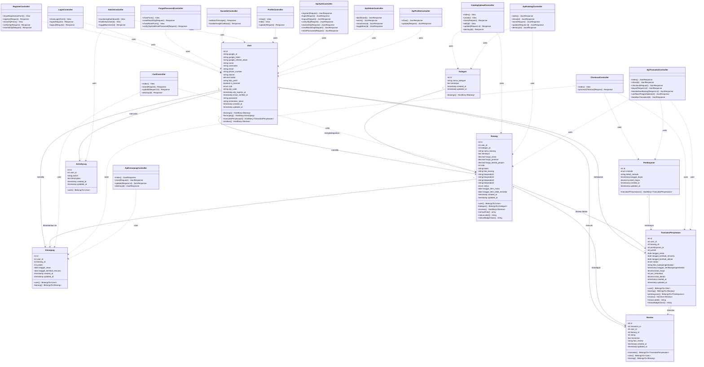

```mermaid
classDiagram
    direction TB

    class User {
        -int id
        -string google_id
        -string google_token
        -string google_refresh_token
        -string name
        -string username
        -string email
        -string phone_number
        -string alamat
        -decimal saldo
        -string foto_profil
        -boolean is_banned
        -enum role
        -string otp_code
        -timestamp otp_expires_at
        -timestamp email_verified_at
        -string password
        -string remember_token
        -timestamp created_at
        -timestamp updated_at
        +barangs() HasMany~Barang~
        +keranjang() HasMany~Keranjang~
        +transaksiPenyewaan() HasMany~TransaksiPenyewaan~
        +reviews() HasMany~Review~
    }

    class Kategori {
        -int id
        -string nama_kategori
        -text deskripsi
        -timestamp created_at
        -timestamp updated_at
        +barangs() HasMany~Barang~
    }

    class Barang {
        -int id
        -int user_id
        -int kategori_id
        -string nama_barang
        -text deskripsi
        -decimal harga_sewa
        -decimal harga_jaminan
        -decimal harga_denda_perjam
        -int stok
        -string lokasi
        -string foto_barang
        -string fotoproduk1
        -string fotoproduk2
        -string fotoproduk3
        -string fotoproduk4
        -enum status
        -date tanggal_item_mulai
        -date tanggal_item_tidak_tersedia
        -timestamp created_at
        -timestamp updated_at
        +user() BelongsTo~User~
        +kategori() BelongsTo~Kategori~
        +reviews() HasMany~Review~
        +semuaFoto() array
        +statusLabel() string
        +statusBadgeClass() string
    }

    class Keranjang {
        -int id
        -int user_id
        -int barang_id
        -int jumlah
        -date tanggal_sewa
        -date tanggal_kembali_rencana
        -timestamp created_at
        -timestamp updated_at
        +user() BelongsTo~User~
        +barang() BelongsTo~Barang~
    }

    class Pembayaran {
        -int id
        -enum metode
        -string detail_metode
        -timestamp tanggal_bayar
        -decimal jumlah_bayar
        -timestamp created_at
        -timestamp updated_at
        +transaksiPenyewaans() HasMany~TransaksiPenyewaan~
    }

    class TransaksiPenyewaan {
        -int id
        -int user_id
        -int barang_id
        -int pembayaran_id
        -int jumlah
        -date tanggal_sewa
        -date tanggal_kembali_rencana
        -date tanggal_kembali_aktual
        -enum status
        -string foto_buktipengembalian
        -timestamp tanggal_verifikasipengembalian
        -decimal total_harga
        -int jam_terlambat
        -decimal total_denda
        -timestamp created_at
        -timestamp updated_at
        +user() BelongsTo~User~
        +barang() BelongsTo~Barang~
        +pembayaran() BelongsTo~Pembayaran~
        +review() HasOne~Review~
        +statusLabel() string
        +statusBadgeClass() string
    }

    class Review {
        -int id
        -int transaksi_id
        -int user_id
        -int barang_id
        -int rating
        -text komentar
        -string foto_review
        -timestamp created_at
        -timestamp updated_at
        +transaksi() BelongsTo~TransaksiPenyewaan~
        +user() BelongsTo~User~
        +barang() BelongsTo~Barang~
    }

    class ActivityLog {
        -int id
        -int user_id
        -string action
        -text description
        -timestamp created_at
        -timestamp updated_at
        +user() BelongsTo~User~
    }

    %% ─── Controller Classes ───

    class RegisterController {
        +showRegistrationForm() View
        +register(Request) Response
        +showOtpForm() View
        +verifyOtp(Request) Response
        +resendOtp(Request) Response
    }

    class LoginController {
        +showLoginForm() View
        +login(Request) Response
        +logout(Request) Response
    }

    class ForgotPasswordController {
        +showForm() View
        +sendResetOtp(Request) Response
        +showResetForm() View
        +verifyOtpAndResetPassword(Request) Response
    }

    class SocialiteController {
        +redirectToGoogle() Response
        +handleGoogleCallback() Response
    }

    class AdminController {
        +monitoringDashboard() View
        +lihatDetailUser(id) View
        +toggleBanUser(id) Response
    }

    class CartController {
        +index() View
        +store(Request) Response
        +update(Request id) Response
        +destroy(id) Response
    }

    class CheckoutController {
        +index() View
        +processCheckout(Request) Response
    }

    class KatalogUploadController {
        +index() View
        +create() View
        +store(Request) Response
        +edit(id) View
        +update(Request id) Response
        +destroy(id) Response
    }

    class ProfileController {
        +show() View
        +edit() View
        +update(Request) Response
    }

    class ApiAuthController {
        +register(Request) JsonResponse
        +login(Request) JsonResponse
        +logout(Request) JsonResponse
        +verifyOtp(Request) JsonResponse
        +resendOtp(Request) JsonResponse
        +sendResetOtp(Request) JsonResponse
        +resetPassword(Request) JsonResponse
    }

    class ApiKatalogController {
        +index() JsonResponse
        +show(id) JsonResponse
        +store(Request) JsonResponse
        +update(Request id) JsonResponse
        +destroy(id) JsonResponse
    }

    class ApiKeranjangController {
        +index() JsonResponse
        +store(Request) JsonResponse
        +update(Request id) JsonResponse
        +destroy(id) JsonResponse
    }

    class ApiTransaksiController {
        +index() JsonResponse
        +show(id) JsonResponse
        +checkout(Request) JsonResponse
        +bayar(Request id) JsonResponse
        +kembalikanBarang(Request id) JsonResponse
        +verifikasiPengembalian(id) JsonResponse
        +batalkanTransaksi(id) JsonResponse
    }

    class ApiAdminController {
        +dashboard() JsonResponse
        +users() JsonResponse
        +showUser(id) JsonResponse
        +toggleBan(id) JsonResponse
    }

    class ApiProfileController {
        +show() JsonResponse
        +update(Request) JsonResponse
    }

    %% ─── Model Relationships ───
    User "1" --> "*" Barang : memiliki
    User "1" --> "*" Keranjang : memiliki
    User "1" --> "*" TransaksiPenyewaan : melakukan
    User "1" --> "*" Review : menulis
    User "1" --> "*" ActivityLog : mencatat
    Kategori "1" --> "*" Barang : mengkategorikan
    Barang "1" --> "*" Keranjang : ditambahkan ke
    Barang "1" --> "*" TransaksiPenyewaan : disewa dalam
    Barang "1" --> "*" Review : mendapat
    Pembayaran "1" --> "*" TransaksiPenyewaan : membayar
    TransaksiPenyewaan "1" --> "0..1" Review : direview

    %% ─── Controller → Model Dependencies ───
    RegisterController ..> User : uses
    LoginController ..> User : uses
    ForgotPasswordController ..> User : uses
    SocialiteController ..> User : uses
    AdminController ..> User : uses
    AdminController ..> ActivityLog : uses
    CartController ..> Keranjang : uses
    CartController ..> Barang : uses
    CheckoutController ..> TransaksiPenyewaan : uses
    CheckoutController ..> Pembayaran : uses
    CheckoutController ..> Keranjang : uses
    KatalogUploadController ..> Barang : uses
    KatalogUploadController ..> Kategori : uses
    ProfileController ..> User : uses
    ApiAuthController ..> User : uses
    ApiKatalogController ..> Barang : uses
    ApiKatalogController ..> Kategori : uses
    ApiKeranjangController ..> Keranjang : uses
    ApiTransaksiController ..> TransaksiPenyewaan : uses
    ApiTransaksiController ..> Pembayaran : uses
    ApiTransaksiController ..> Barang : uses
    ApiAdminController ..> User : uses
    ApiProfileController ..> User : uses
```
